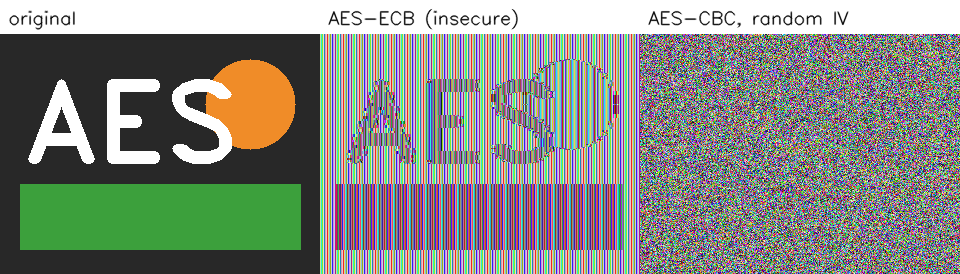

# AES-128 from scratch

A from-scratch implementation of AES-128 in pure Python (FIPS 197), with CBC mode, password-based keys, and
authenticated encryption, used to encrypt text, pictures and video.

> **Learning project.** It is not constant-time and has not been audited. Don't use it to protect real data;
> use a vetted library such as [`cryptography`](https://cryptography.io/) for that. See [Limitations](#limitations).



*Same picture, same block cipher. ECB encrypts equal blocks to equal blocks, so the shapes survive. CBC with a random IV does not leak them.*
(`python demo_ecb_vs_cbc.py` regenerates this. ECB exists only in that script.)

## Quick start

```bash
pip install -r requirements.txt          # numpy + opencv-python, only needed for pictures
python TryMe.py encrypt-picture photo.png photo_encrypted.png
python TryMe.py decrypt-picture photo_encrypted.png photo_decrypted.png
python TryMe.py encrypt-video   clip.mp4 clip.aes
python TryMe.py decrypt-video   clip.aes clip_decrypted.mp4
python -m unittest -v test_aes           # 32 tests, ~2 s
```

From Python:

```python
from AES_Class import AES

aes = AES("a long passphrase")
aes.encryptPicture("photo.png", "photo_encrypted.png")     # the ciphertext is itself a .png of noise
aes.decryptPicture("photo_encrypted.png", "photo_decrypted.png")
aes.encryptFile("clip.mp4", "clip.aes")                    # any file; encryptVideo is an alias
```

## How it works

| Layer | What it does | Standard |
|---|---|---|
| Block cipher | `expandKey`, `encryptBlock`, `decryptBlock`: SubBytes, ShiftRows, MixColumns, AddRoundKey over GF(2^8), 10 rounds, no MixColumns in the last | FIPS 197 |
| Mode | CBC, PKCS#7 padding, a fresh random 16-byte IV every time | NIST SP 800-38A |
| Container | PBKDF2-HMAC-SHA256 (600,000 iterations, random salt) yields an AES key and a separate MAC key; HMAC-SHA256 over header + ciphertext; the tag is checked **before** anything is decrypted | encrypt-then-MAC |
| Helpers | text (base64), files/video (raw bytes), pictures (pixels, stored as a lossless noise PNG) | |

File format: `"AESK" | version (1) | PBKDF2 iterations (4) | salt (16) | IV (16) | ciphertext | HMAC tag (32)`.
Overhead is 41 header bytes + 1 to 16 padding bytes + 32 tag bytes.

Design choices worth knowing:

- **Encrypt-then-MAC, verified first.** Wrong passwords and tampered files fail with one error and no output is written.
  Checking the MAC before decrypting also removes padding-oracle attacks on CBC.
- **Independent keys** for encryption and authentication, both derived from one password.
- **Video is encrypted as a file, not frame by frame.** Frames decoded from a compressed video, encrypted, then re-saved
  with a lossy codec no longer decrypt: the codec rewrites the ciphertext. Encrypting the compressed bytes is lossless by
  construction, gives byte-identical output, and is far less data.
- **Pictures are stored as PNG** (lossless). JPEG output is refused. Width, height and channels, including transparency, are stored inside the encrypted payload.

## Verification

`python -m unittest -v test_aes` runs 32 tests:

| Check | Source |
|---|---|
| Encrypt and decrypt of the worked examples | FIPS 197 Appendix B and C.1 |
| Round keys 1 and 10 of the key schedule | FIPS 197 Appendix A.1 |
| GF(2^8) products `{57}·{83} = {c1}`, `{57}·{13} = {fe}` | FIPS 197 section 4.2 |
| S-box regenerated from first principles (multiplicative inverse + affine map) and compared with the table | FIPS 197 section 5.1.1 |
| 4-block CBC encrypt and decrypt | NIST SP 800-38A F.2.1 / F.2.2 |
| Random keys and blocks, ECB and padded CBC, against a reference implementation | `cryptography` (skipped if not installed) |
| Every single-byte flip anywhere in a container is rejected; wrong password, truncation and an absurd iteration count are rejected | container tests |
| Text, files and pictures (grey, colour, alpha, odd sizes) and a real `.mp4` round-trip exactly | file tests |
| A flat image encrypts to noise: no repeated 16-byte blocks, entropy above 7.9 bits/byte | picture tests |

The tests were also checked by deliberately breaking the code (a final-round MixColumns, no IV, a skipped MAC check,
unchecked padding, one wrong S-box entry). Each break made at least one test fail.

## Performance

About 325 KiB/s on the machine this was built on (pure Python, ~48 µs per block), plus ~0.8 s to derive keys.
A 657 KB video takes about 3 s each way, a 1.5 MB video about 5.5 s, and a 1280×1267 RGBA picture about 22 s.

## Limitations

- **Not constant-time.** Table lookups and Python's execution model leak timing and cache behaviour. It is not
  side-channel resistant, and Python can't wipe keys from memory.
- **Unaudited and slow.** Pure Python; the whole file is held in memory (no streaming).
- **CBC is not the modern default.** AES-GCM or ChaCha20-Poly1305 give authentication in one primitive. CBC + HMAC is
  used here because it exercises the block cipher's decrypt direction and is a sound, well-understood construction.
- **PBKDF2 is GPU-friendly.** scrypt or Argon2 resist cracking hardware better. A weak password is still the weakest link.
- **Metadata is visible:** the file's approximate size, the iteration count, and that it is an `AESK` container.

## Changes from the first version

The first version was checked against the FIPS 197 test vectors and a reference implementation, which found the problems below.

| First version | Problem | Now |
|---|---|---|
| State filled row by row; MixColumns also in the final round | Not AES: output differed from the standard, failed the FIPS 197 vectors | Column-major state (section 3.4), no final MixColumns; passes the vectors |
| First block encrypted with no IV | Deterministic: same key and data gave the same ciphertext, identical video frames gave identical encrypted frames | Random IV and salt per encryption |
| No integrity check | Tampering was undetected | HMAC-SHA256, encrypt-then-MAC |
| Key = the 16 typed characters | No key derivation; brute-forceable; raw bytes like `\r` were mangled by text-mode reads | PBKDF2, salt, separate MAC key, any-length UTF-8 password |
| Padding with spaces, none when aligned | Decrypted text gained trailing spaces | PKCS#7; exact round trip |
| Video: encrypt decoded frames, save with a lossy codec | Ciphertext corrupted; the decrypted frame was noise (PSNR 10.4 dB against 39.4 dB for an ordinary lossy copy) | File-level encryption; byte-identical output |
| `HexToInt` converted the global `RCON` table in place | A second `AES()` in one process crashed | Tables are never modified; regression test |
| Hex-string state, ~23 KiB/s | ~24 s per 480×360 frame | Integer state and precomputed multiplication tables, ~325 KiB/s |
| Hard-coded `MessageIn.txt` (overwritten by the picture path); pictures resized to 480×360; transparency dropped | Silent data loss and clobbered files | Explicit input and output paths; original size and alpha preserved |

## Files

- `AES_Class.py`: the cipher, mode, container and helpers (standard library only, plus numpy/OpenCV for pictures)
- `TryMe.py`: command-line front end
- `test_aes.py`: tests
- `demo_ecb_vs_cbc.py`: draws the figure above
